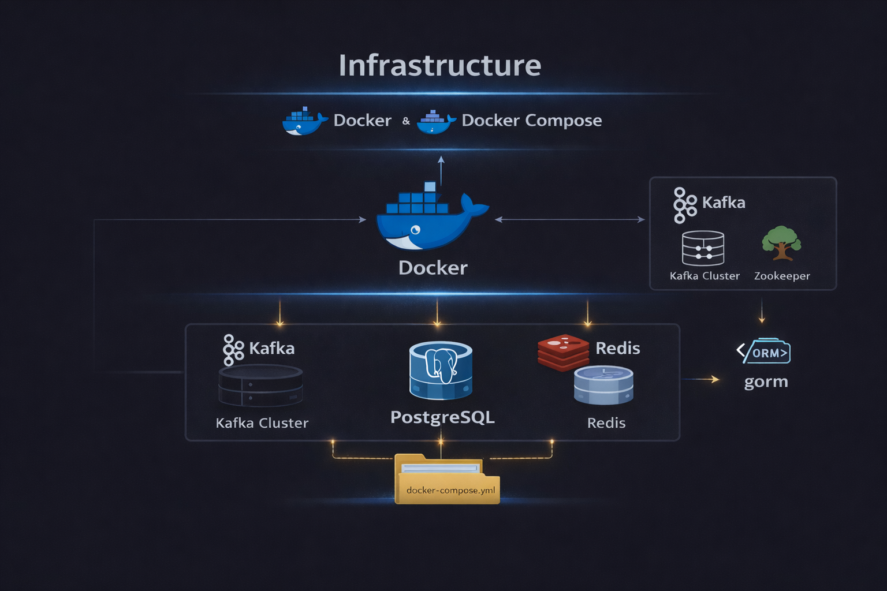
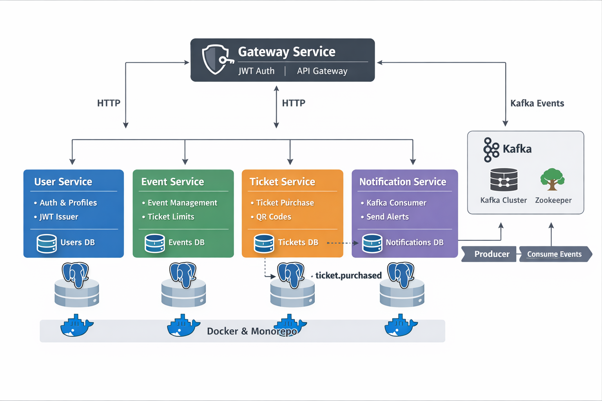

# Сбор: Платформа управления мероприятиями и продажи билетов

## Описание проекта

**Сбор** — микросервисная платформа для полного управления мероприятиями, позволяющая организаторам создавать события, управлять расписанием и продавать билеты онлайн с поддержкой уведомлений в реальном времени и валидацией по QR-кодам. Система решает проблему децентрализованного управления мероприятиями благодаря интегрированной платформе, которая обеспечивает аутентификацию, организацию мероприятий, продажу билетов и автоматизированные уведомления пользователям через несколько микросервисов.

## Технологический стек

### Язык программирования
- **Go** (1.21+) — Бэкенд-сервисы и API Gateway

### Бэкенд и фреймворки
- **Gin** — Фреймворк для HTTP-маршрутизации и middleware
- **PostgreSQL** (16) — Постоянное хранилище данных (отдельные БД для каждого сервиса)
- **Apache Kafka** (3.7) — Event-driven архитектура и межсервисное взаимодействие
- **Redis** — Кеширование и хранение настроек уведомлений
- **JWT (JSON Web Tokens)** — Аутентификация и авторизация


## infrostructure



## Архитектура



### Инфраструктура и инструменты
- **Docker & Docker Compose** — Контейнеризация и оркестрация
- **Kafka UI** — Мониторинг Kafka кластера
- **Air** — Hot reloading при разработке
- **Make** — Автоматизация сборки и задач
- **golangci-lint** — Проверка качества кода

## Разработчики

- [@Strannik-chr](https://github.com/Strannik-chr)

## Запуск проекта локально

### Требования

- **Go** 1.21+
- **Docker** & **Docker Compose**
- **Make**

### Запуск проекта

#### 1. Настройка переменных окружения

Скопируйте пример файла окружения:
```bash
cp .env.example .env
```

Обновите `.env` с вашей конфигурацией:
```bash
# База данных
POSTGRES_USER=postgres
POSTGRES_PASSWORD=yourpassword
USER_DB_NAME=user_db
TICKETS_DB_NAME=tickets_db
EVENTS_DB_NAME=events_db
NOTIFICATIONS_DB_NAME=notifications_db

# Сервисы
USER_SERVICE_URL=http://localhost:8081
TICKET_SERVICE_URL=http://localhost:8082
EVENT_SERVICE_URL=http://localhost:8083
NOTIFICATION_SERVICE_URL=http://localhost:8084

# Kafka
KAFKA_BROKER=kafka:9092

# Redis
REDIS_PORT=6379
```

#### 2. Запуск инфраструктуры и сервисов

Все сервисы запускаются через Docker Compose:

```bash
docker-compose up -d
```

Это запустит:
- **API Gateway** (порт 8000)
- **User Service** (порт 8081)
- **Ticket Service** (порт 8082)
- **Event Service** (порт 8083)
- **Notification Service** (порт 8084)
- **PostgreSQL** (4 отдельных экземпляра)
- **Kafka** (порт 9092)
- **Kafka UI** (порт 8080)
- **Redis** (порт 6379)

#### 3. Инициализация Kafka топиков

Создайте необходимые Kafka топики:

```bash
make kafka-topics
```

#### 4. Доступ к системе

- **API Gateway**: http://localhost:8000
- **Kafka UI**: http://localhost:8080

### Локальная разработка (опционально)

Для разработки с hot reloading вы можете запустить отдельные сервисы:

#### User Service
```bash
cd user-service
make dev  # или: go run ./cmd/app
```

#### Event Service
```bash
cd event-service
make dev  # или: go run ./cmd/app
```

#### Ticket Service
```bash
cd ticket-service
go run ./cmd/app
```

#### Notification Service
```bash
cd notification-service
go run ./cmd/app
```

#### API Gateway
```bash
cd gateway
go run .
```

### Полезные команды

```bash
# Запуск всех тестов
make test

# Проверка качества кода
make lint

# Форматирование кода
make fmt

# Проверка типов
make vet

# Обновление зависимостей
make tidy

# Остановка всех сервисов
docker-compose down

# Просмотр логов сервиса
docker-compose logs -f <service-name>
```

---

### Обзор архитектуры

Система следует архитектуре микросервисов со следующими компонентами:

- **API Gateway** (Порт 8000): Точка входа для всех запросов клиентов, валидация JWT и маршрутизация
- **User Service** (Порт 8081): Аутентификация пользователей, регистрация, управление профилем и ролями
- **Event Service** (Порт 8083): Создание, управление, планирование мероприятий и категоризация
- **Ticket Service** (Порт 8082): Создание типов билетов, продажа билетов и генерация QR-кодов
- **Notification Service** (Порт 8084): Push-уведомления, доставка электронных писем и настройки уведомлений
- **Kafka**: Асинхронное взаимодействие между сервисами через события
- **PostgreSQL**: Постоянное хранилище данных с отдельными БД для каждого сервиса

Подробную информацию о бизнес-процессах смотрите в `BUSINESS_FLOWS.md`, а полный обзор системы в `PRESENTATION.md`.
